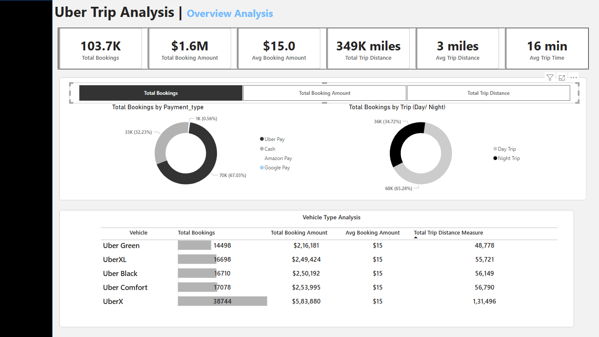

# 🚖 Uber Trip Analysis – Power BI Dashboard

## 📌 Project Overview
This project presents a comprehensive **Power BI dashboard** that analyzes Uber trip data to provide insights into **booking patterns, revenue trends, trip efficiency**, and customer behavior. The analysis helps stakeholders make **data-driven decisions** to optimize pricing, trip offerings, and customer satisfaction.

---

## 🎯 Business Requirement

**Goal:** Analyze Uber trip data to uncover trends in bookings, revenue generation, and trip efficiency.

### Key Objectives:
- Identify **trends** in ride bookings and revenue generation.
- Analyze **trip efficiency** by distance and duration.
- Compare metrics across **different time periods**, payment methods, and trip types.
- Support **strategic planning** by providing actionable insights.

---

## 📊 Key KPIs

| Metric | Description |
|--------|-------------|
| **Total Bookings** | Number of trips booked |
| **Total Booking Value** | Total revenue generated |
| **Average Booking Value** | Revenue per booking |
| **Total Trip Distance** | Total distance traveled |
| **Average Trip Distance** | Avg. distance per trip |
| **Average Trip Time** | Avg. trip duration |

---

## 📈 Charts and Features

### ✅ Overview Analysis:
- KPI Cards for Total Bookings, Revenue, Distance, and Time
- **Dynamic Measure Selector** to switch between:
  - Total Bookings
  - Total Booking Value
  - Total Trip Distance

### ✅ Drilldowns:
- **By Payment Type** (Cash, Uber Pay, Google Pay, etc.)
- **By Trip Type** (Day vs. Night)
- **Vehicle Type Analysis** in Matrix View:
  - UberX, UberXL, Uber Black, etc.
  - Highlighted with **conditional formatting**
  - Sortable and filterable

### ✅ Additional Enhancements:
- 📅 Date, City slicers for dynamic filtering
- 🏷️ Dynamic chart titles based on selected measure
- 🧠 Tooltips for extra insights (Avg Trip Time, Booking Value)

---

## 🌐 Live Report Access

Due to organization restrictions, public web access isn't available. However, you can:

- 🔗 [Download the PDF Report](https://github.com/your-repo/assets/Uber_Trip_Analysis.pdf)
- 📂 [Download the PBIX File](https://github.com/your-repo/assets/Uber_Trip_Analysis.pbix) *(View in Power BI Desktop)*

---

## 📸 Screenshots

| KPI Summary | Payment Breakdown | Vehicle Type Grid |
|-------------|-------------------|--------------------|
|  |  |  |

---

## 🛠️ Tech Stack
- **Power BI Desktop**
- DAX & Power Query
- CSV/Excel dataset

---

## 📁 Repository Structure
. ├── assets/ │ ├── dashboard-preview.png │ ├── Uber_Trip_Analysis.pdf │ ├── Uber_Trip_Analysis.pbix │ ├── kpi-summary.png │ ├── payment-type.png │ └── vehicle-analysis.png ├── README.md
